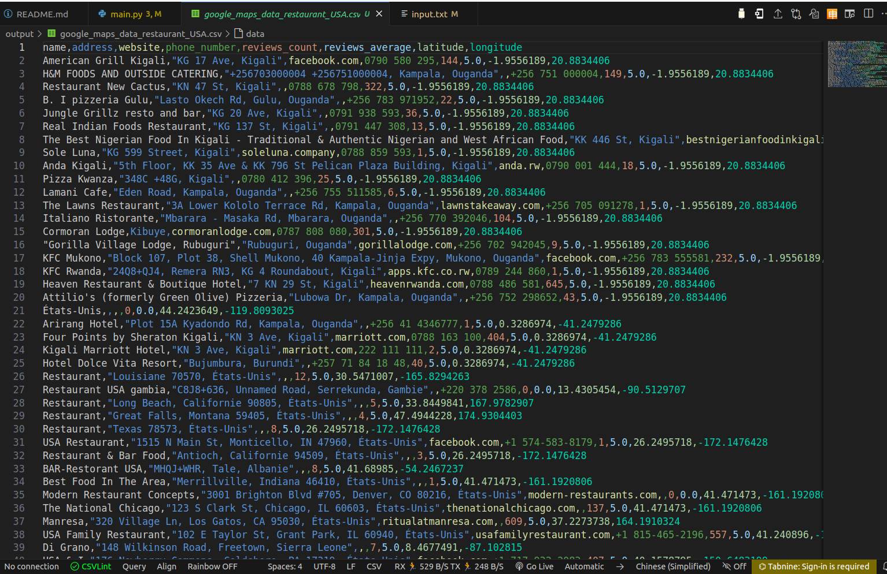
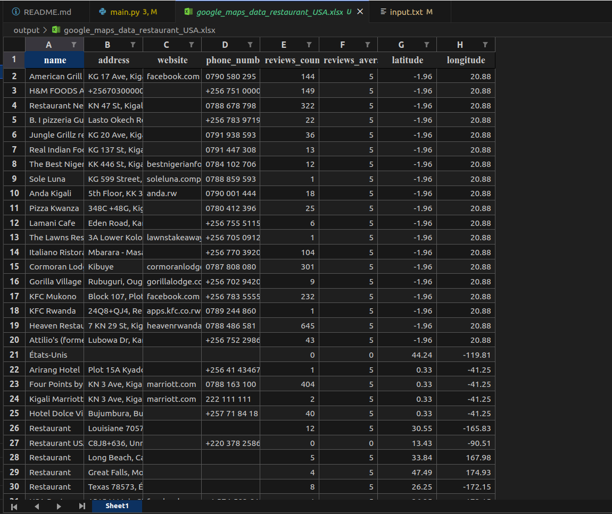

# Scrape-businesses-in-a-region-on-google-maps-with-python






# Business Data Scraper

## Overview

The `Business Data Scraper` is a Python script that utilizes Playwright and BeautifulSoup to scrape business data from Google Maps. This script searches for businesses based on provided search terms and regions, retrieves detailed business information including name, address, website, phone number, reviews count, and average reviews, and saves the data to both Excel and CSV files.

## Features

- **Search and Scrape**: Searches for businesses on Google Maps based on provided search terms and regions.
- **Data Extraction**: Extracts key business information including:
  - Name
  - Address
  - Website
  - Phone Number
  - Reviews Count
  - Average Reviews
  - Latitude and Longitude
- **Output**: Saves the extracted data to Excel and CSV files for easy access and analysis.

## Requirements

- Python 3.7 or higher
- Playwright
- BeautifulSoup
- pandas

You can install the required packages using `pip`:

```bash
pip install playwright beautifulsoup4 pandas
playwright install

Usage
To run the script, use the following command:

python script_name.py -s "search_term" -t total_results -r region1 region2 ...

Command Line Arguments
-s, --search (required): The search term or keyword for the business you want to find.
-t, --total (optional): The total number of business listings to scrape (default is 1,000).
-r, --regions (optional): A list of regions to search in (default includes USA, Australia, UK, New Zealand).


Example:

python script_name.py -s "restaurant" -t 500 -r "USA" "Canada"

Alternatively, you can place search terms in a file named input.txt, with each term on a new line. Simply omit the -s argument when running the script.


How It Works
Initialization: The script initializes Playwright and opens a new browser page.
Search and Navigation: Performs searches on Google Maps based on the provided search terms and regions.
Data Scraping: Clicks on each business listing to retrieve detailed information using BeautifulSoup for HTML parsing.
Data Storage: Saves the scraped data to Excel and CSV files in the output directory.
Benefits for Businesses
Market Research: Quickly gather detailed information on competitors or potential partners within specific regions.
Lead Generation: Identify and collect contact details of businesses for outreach and partnerships.
Data Analysis: Analyze reviews and ratings to gain insights into market trends and customer preferences.
Efficiency: Automate the data collection process, saving time and reducing manual effort.
Notes
Ensure you have the appropriate permissions and comply with Google Maps' terms of service when scraping data.
The script may need adjustments if Google Maps updates its layout or if specific elements change.

### **Contributors**
- [Gabin H. VEGLO](https://github.com/VEGLOgabin)

### **License**
#**This project is licensed under the MIT License.**#

